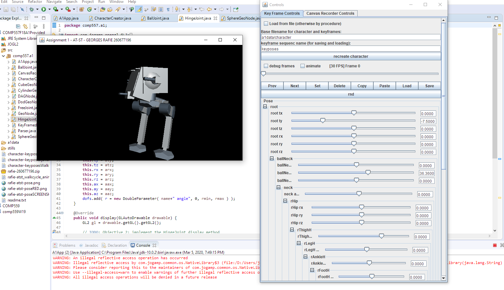

# Computer-Graphics-Project(s)

Computer Graphics: Character Rigging and Geometry Hierarchy (project) from my Computer Graphics class at McGill University (COMP 557)

Realized using JOGL (Java), core features of the Java application by prof. Paul Kry, Associate Prof. at McGill.
Character Geometry and Rigging created and coded by myself (inspired by a Star Wars AT-ST vehicle),
Walk-cycle animated by myself using the Java Application controls in the GUI. (watch video)

Georges Rafie - 2018 Project
